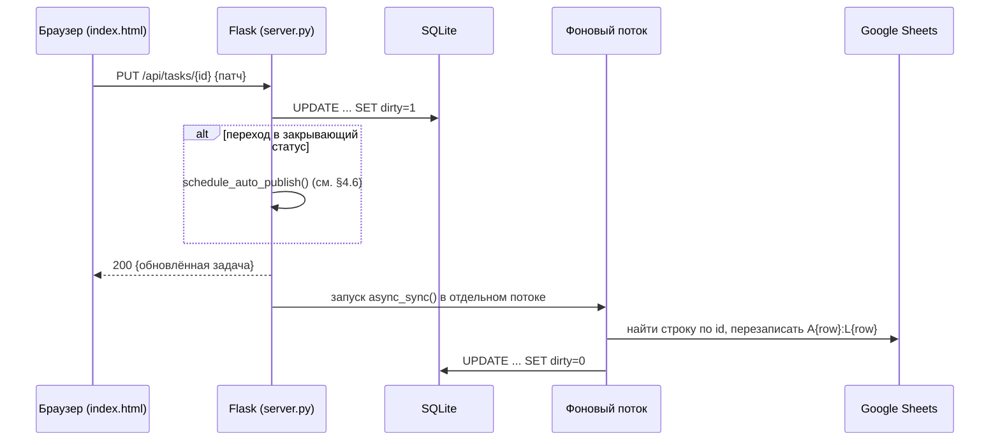
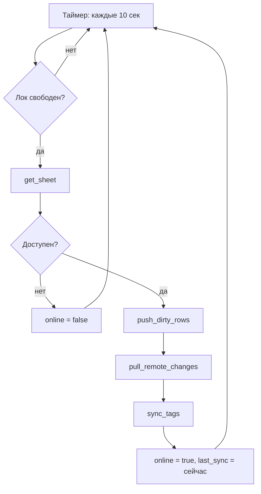
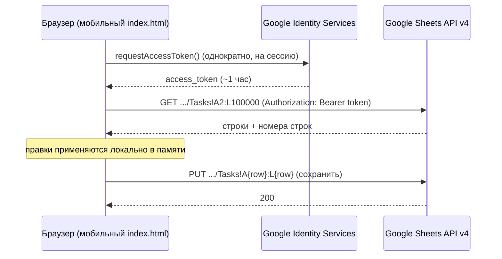

# Техническое описание — инженерный уровень

Дополняет `README.md`. Здесь — контракты API, схема хранения, точные алгоритмы
и форматы данных, по которым можно воспроизвести бэкенд заново, не читая код.
Реальные идентификаторы (ID таблицы, имя GitHub-репозитория, токены, ключи)
нигде не приводятся — только плейсхолдеры.

## 1. Компоненты и их роль

| Компонент | Технология | Хранит состояние? | Пишет в Google Sheets |
|---|---|---|---|
| Десктоп-бэкенд | Python 3, Flask | Да (SQLite) | Да, через `gspread` (сервисный аккаунт) |
| Десктоп-фронтенд | Статический HTML/JS | Нет | Через десктоп-бэкенд (`/api/...`) |
| Мобильный клиент | Статический HTML/JS (PWA) | Нет (кроме OAuth-токена в `localStorage`) | Да, напрямую через REST Google Sheets API v4 |
| Публичный отчёт | Статический HTML/JS | Нет | Не пишет вообще, только читает локальный зашифрованный файл |

## 2. API десктоп-бэкенда (Flask, `localhost:5000`)

Все ответы — `application/json`, кроме `GET /`, `/analytics.html`, `/planning.html`,
`/theme.js` (отдают статические файлы напрямую).

### 2.1 Задачи

**`GET /api/tasks`**
Возвращает все незакрытые локально задачи (`deleted=0` в SQLite).
```json
{
  "tasks": [ { "id": "1", "Задача": "...", "Статус": "...", "Проект": "...",
               "Подпроект": "...", "Приоритет": "...", "Дата закрытия": "дд.мм.гггг",
               "Создано": "дд.мм.гггг", "Примечания": "...", "№ заявки": "...",
               "Актуально": "дд.мм.гггг", "Родитель": "" } ],
  "statuses": ["Бэклог", "Не начато", "Выполняется", "На паузе", "Заблокировано", "Выполнено"]
}
```

**`POST /api/tasks`**
Тело — объект задачи (любое подмножество полей, отсутствующие берутся по
умолчанию: `Статус` = `Не начато`, `Создано` = сегодня, `Актуально` = сегодня,
`Родитель` = `""`, если не передано). `id` генерируется сервером как
`max(существующих id) + 1`.
Если `Статус` в переданном теле — закрывающий (см. §4.3), а `Дата закрытия`
не передана — подставляется сегодняшняя дата ещё до записи.
Создаёт запись со `dirty=1`, запускает асинхронную синхронизацию; если статус
закрывающий — дополнительно ставит в очередь отложенную публикацию отчёта
(см. §4.6).
Ответ: `201`, тело — созданный объект задачи.

**`PUT /api/tasks/<task_id>`**
Тело — частичный патч (только изменяемые поля, включая `Родитель`, если нужно
его сменить). Перед записью применяется правило автопроставления даты
закрытия (см. §4.3). Помечает строку `dirty=1`, запускает асинхронную
синхронизацию; если переход в закрывающий статус произошёл именно этим
запросом — дополнительно ставит в очередь отложенную публикацию отчёта.
Ответ: `200` с полным объектом задачи после слияния, либо `404`, если `id` не
найден.

**`DELETE /api/tasks/<task_id>`**
Мягкое удаление — выставляет `deleted=1, dirty=1` в SQLite (физическая строка в
Sheets удаляется позже, во время фоновой синхронизации). Ответ: `204`, либо
`404`.

### 2.2 Теги

**`GET /api/tags`** → `{"Проект": ["..."], "Подпроект": ["..."]}`

**`POST /api/tags/<category>`** — `category` ∈ `{Проект, Подпроект}`.
Тело: `{"value": "строка"}`. Добавляет значение, если его ещё нет, сортирует
список. Ответ — обновлённый список для этой категории. `400`, если категория
не из списка или `value` пустое.

**`DELETE /api/tags/<category>/<value>`** — убирает `value` из списка (только
из справочника, у уже проставленных задач значение не меняется). Ответ —
обновлённый список.

### 2.3 Синхронизация

**`GET /api/sync-status`**
```json
{ "online": true, "last_sync": "14:32:10", "last_error": null, "pending": 0 }
```
`pending` — число строк в SQLite с `dirty=1` на момент запроса.

### 2.4 Скриншот

**`POST /api/screenshot`** — тело `{"image": "data:image/png;base64,..."}`.
Декодирует и сохраняет PNG в `SCREENSHOTS_DIR` с именем
`analytics_ГГГГ-ММ-ДД_ЧЧММСС.png`. Ответ: `{"saved": "<имя файла>"}`, либо
`400`, если строка не в ожидаемом формате data URL.

### 2.5 Публичный отчёт

**`GET /api/report-password/status`** → `{"is_set": true|false}`

**`POST /api/report-password`** — тело `{"password": "..."}`. Перезаписывает
`REPORT_PASSWORD_FILE` целиком (без хеширования — читается в открытом виде при
публикации). `400` при пустом пароле.

**`POST /api/publish-report`** — тело `{"password": "опционально"}`. Снимок
задач берётся сервером из локальной SQLite (`get_all_tasks_for_report()`,
`SELECT * FROM tasks WHERE deleted=0`), а не из тела запроса. Если `password`
не передан — берётся сохранённый (`REPORT_PASSWORD_FILE`); если нигде нет —
`400 {"error": "пароль ещё не задан"}`.
Шифрует снимок (см. §5), сохраняет `PUBLIC_REPORT_DIR/report-data.json`,
пытается залить его в GitHub (см. §2.7). Обновляет `last_publish`/`last_error`
в состоянии автопубликации (см. §2.6).
Ответ:
```json
{ "saved": "/абсолютный/путь/report-data.json",
  "pushed_to_github": true,
  "github_note": null }
```
`github_note` — причина, если автозаливка не удалась или не настроена;
`pushed_to_github` в этом случае `false`, но `saved` всё равно возвращается —
локальный файл создаётся независимо от результата заливки.

### 2.6 Автопубликация отчёта

**`GET /api/auto-publish/status`**
```json
{ "enabled": true, "last_publish": "28.09.2026 18:26:09", "last_error": null, "pending": false }
```
`pending` — `true`, пока действует отложенный таймер публикации (см. §4.6).

**`POST /api/auto-publish/toggle`** — тело `{"enabled": true|false}`. Состояние
сохраняется в `AUTO_PUBLISH_CONFIG_FILE` (`auto_publish.json`), переживает
перезапуск сервера. При выключении отменяет уже запланированный, но ещё не
сработавший таймер публикации. Ответ — тот же объект состояния, что и в
`GET /api/auto-publish/status`.

### 2.7 Автозаливка в GitHub (внутренняя, не HTTP-эндпоинт)

Вызывается из `/api/publish-report` и из отложенной автопубликации. Использует
GitHub Contents API:
1. `GET https://api.github.com/repos/{repo}/contents/{path}?ref={branch}` —
   получить текущий `sha` файла (нужен для обновления существующего файла).
2. `PUT https://api.github.com/repos/{repo}/contents/{path}` — тело
   `{"message": "...", "content": "<base64 файла>", "branch": "...", "sha": "<если было>"}`.
   Заголовок `Authorization: Bearer <токен>`.

Если файл токена (`GITHUB_TOKEN_FILE`) отсутствует — функция возвращает
`(None, "автопубликация не настроена…")` и остальной пайплайн не прерывается.

### 2.8 Архивация старых задач

**`GET /api/cleanup/preview`**
```json
{ "count": 2, "cutoff": "28.09.2025" }
```
Считает закрытые задачи (`Статус` ∈ `{Выполнено, Заблокировано}`) с полем
`Дата закрытия` раньше `сегодня - 365 дней`, ничего не меняет.

**`POST /api/cleanup/run`** — переносит те же задачи на лист `Архив` тем же
запросом (`append_rows`), затем помечает их `deleted=1, dirty=1` в SQLite —
из `Tasks` они исчезнут при очередной синхронизации через штатный механизм
удаления (§4.1). Если соединения с таблицей нет — `503` с ошибкой, ничего не
удаляется. Ответ при успехе:
```json
{ "archived": 2, "cutoff": "28.09.2025" }
```
Открытые задачи не рассматриваются в принципе, независимо от дат в их полях.

## 3. Схема SQLite (`tracker.db`, таблица `tasks`)

Одна таблица, без внешних ключей и индексов сверх implicit rowid.

| Колонка | Тип | Смысл |
|---|---|---|
| `id` | TEXT | Совпадает с колонкой A в Google Sheets |
| `task` | TEXT | Задача |
| `status` | TEXT | Статус |
| `project` | TEXT | тег «Процесс» (колонка `Проект` в Sheets) |
| `subproject` | TEXT | тег «Проект» (колонка `Подпроект` в Sheets) |
| `priority` | TEXT | Приоритет |
| `due` | TEXT | Дата закрытия |
| `created` | TEXT | Создано |
| `notes` | TEXT | Примечания |
| `ticket` | TEXT | № заявки |
| `relevant` | TEXT | Актуально |
| `parent` | TEXT | `id` родительской задачи (колонка `Родитель` в Sheets), пусто у обычных задач |
| `dirty` | INTEGER | `1`, если строка изменена локально и ещё не отправлена в Sheets |
| `deleted` | INTEGER | `1` = мягко удалена, ожидает физического удаления из Sheets при следующей синхронизации |

Все текстовые поля хранят даты как строки `дд.мм.гггг` — то же представление,
что и в самой таблице; парсинг/сравнение дат происходит на уровне
приложения (Python/JS), не на уровне SQL.

Схема мигрируется мягко: при каждом старте `init_db()` добавляет через
`ALTER TABLE` любые колонки из ожидаемого списка полей, которых ещё нет —
это позволяет добавлять новые поля в будущем без ручной миграции существующих
локальных баз. Аналогичной автомиграции для самого листа `Tasks` в Google
Sheets нет — новый заголовок колонки (`Родитель` в `L1`) нужно один раз
проставить в таблице вручную.

## 4. Алгоритм синхронизации

Выполняется в фоновом потоке каждые `SYNC_INTERVAL_SECONDS` (по умолчанию 10),
и дополнительно сразу после каждой мутации через API (`async_sync()` в
отдельном потоке, неблокирующе). Защищён от параллельного запуска
`threading.Lock` — если синхронизация уже идёт, повторный вызов молча
пропускается.

### 4.1 `push_dirty_rows`
Для каждой строки SQLite с `dirty=1`:
- если `deleted=1` — найти строку по `id` в Sheets (`col_values` по колонке A,
  первое совпадение), удалить (`delete_rows`), затем удалить строку из SQLite
  физически;
- иначе — найти строку по `id`; если найдена — перезаписать диапазон
  `A{row}:{последняя_колонка}{row}` целиком; если не найдена — добавить новую
  строку (`append_row`); в обоих случаях сбросить `dirty=0` в SQLite.

Буква последней колонки вычисляется функцией `last_column_letter()` по длине
списка `COLUMNS` (сейчас 12 → `L`), а не захардкожена — при добавлении новой
колонки в `COLUMNS` запись в лист не потребует правки этой части кода.

### 4.2 `pull_remote_changes`
Читает весь лист `Tasks` (`get_all_values()`, без строки заголовка). Вызывается
с флагом `is_initial` — `True` только при самом первом заполнении пустой
локальной базы (см. §4.6). Для каждой строки с непустым `id`:
- если у соответствующей записи в SQLite `dirty=1` — **пропустить** (локальная
  несинхронизированная правка имеет приоритет, не перезаписывается);
- если поле «Актуально» пустое — подставить значение «Создано» (только для
  вычисления, что кладётся в SQLite — т.е. бэкфилл происходит на лету при
  каждом пуле);
- upsert в SQLite (INSERT, если `id` не было, UPDATE, если было), в обоих
  случаях `dirty=0, deleted=0`;
- если `is_initial=False` и статус строки — закрывающий, а до этого записи
  либо не было локально, либо её статус закрывающим не был — это считается
  «новым закрытием» (например, задачу закрыли с телефона), и по итогу прохода
  ставится в очередь отложенная публикация отчёта.

После прохода по всем строкам — построчная сверка: любая запись в SQLite,
чьего `id` нет среди только что прочитанных из Sheets и у которой `dirty=0`,
считается удалённой вручную прямо в таблице (или заархивированной, см. §2.8)
и удаляется из SQLite тоже. Запись с `dirty=1` в этом случае не трогается
(защита от гонки: локальная несинхронизированная правка не должна исчезнуть
только потому, что кто-то успел убрать строку в Sheets раньше, чем локальная
правка туда долетела).

### 4.3 Автоматическая дата закрытия
Правило применяется и в `POST /api/tasks`, и в `PUT /api/tasks/<id>`, до
записи в SQLite (не в синхронизации): если новый `Статус` ∈ `{Выполнено,
Заблокировано}`, а текущий статус до этого не входил в это множество (для
создания — «текущего статуса» просто нет), и поле «Дата закрытия» пусто и в
патче/теле, и в текущей записи (если она есть) — подставляется сегодняшняя
дата. Переключение между `Выполнено` и `Заблокировано` друг в друга дату не
трогает.

### 4.4 `sync_tags`
Объединение множеств, не diff/patch:
1. Прочитать лист `Tags` целиком.
2. Прочитать локальный `tags.json`.
3. Для каждой категории — объединение (`set union`) локального и удалённого
   списков, сортировка.
4. Если итоговое объединение отличается хоть от одной из сторон — переписать
   **обе**: `tags.json` целиком и лист `Tags` целиком (`clear()` +
   `update("A1", ...)` полным списком строк).

Из этого следует: удаление тега на одной стороне не распространяется — при
следующей синхронизации он восстановится из другой стороны, если там ещё
существует.

### 4.5 Диаграмма: запись задачи с десктопа



### 4.6 Отложенная (debounced) публикация отчёта

Отдельный `threading.Timer`, не связанный с циклом синхронизации.
`schedule_auto_publish()` вызывается из трёх мест: `POST /api/tasks` (создание
сразу в закрывающем статусе), `PUT /api/tasks/<id>` (переход в закрывающий
статус), `pull_remote_changes` (закрытие подхвачено из самой таблицы). Логика:

1. Если автопубликация выключена (`auto_publish_state.enabled == False`) —
   ничего не делает.
2. Если уже есть запланированный таймер — отменяет его (`Timer.cancel()`) и
   ставит новый — то есть повторные закрытия подряд не накапливают публикации,
   а просто отодвигают её на `AUTO_PUBLISH_DEBOUNCE_SECONDS` (30 секунд) от
   последнего закрытия.
3. По срабатыванию таймера — та же логика, что у ручной публикации: снимок из
   локальной SQLite, шифрование, сохранение файла, попытка залить в GitHub.
   Если пароль ещё не задан — публикация пропускается, ошибка кладётся в
   `auto_publish_state.last_error`, ничего не падает.

Флаг `is_initial` в `pull_remote_changes` (см. §4.2) явно исключает самый
первый пул при пустой локальной базе — иначе при первом запуске на новой
машине уже закрытые в прошлом задачи воспринимались бы как «только что
закрытые» и вызывали бы публикацию.

### 4.7 Диаграмма: периодический цикл синхронизации



## 5. Формат шифрования публичного отчёта

Симметричное шифрование, пароль никогда не хранится и не передаётся вместе с
шифротекстом.

- **KDF:** PBKDF2-HMAC-SHA256, 100 000 итераций, соль 16 байт (случайная на
  каждую публикацию), длина производного ключа — 32 байта (256 бит).
- **Шифр:** AES-256-GCM, nonce/IV — 12 байт (случайный на каждую публикацию),
  тег аутентификации — стандартные 16 байт, добавляется к шифротексту
  автоматически (совместимо между Python `cryptography` и Web Crypto API без
  дополнительной обработки).
- **Открытый текст** — JSON, снимок из локальной SQLite целиком (все поля
  задачи, включая `Родитель`):
  ```json
  { "generated_at": "дд.мм.гггг ЧЧ:ММ", "tasks": [ /* массив объектов задач, см. §7 */ ] }
  ```
- **Файл-конверт** (`report-data.json`), всё в base64:
  ```json
  { "salt": "...", "iv": "...", "iterations": 100000, "ciphertext": "..." }
  ```

Расшифровка на стороне получателя (`report.html`): `crypto.subtle.importKey`
→ `deriveKey` (PBKDF2 → AES-GCM) → `decrypt`. Неверный пароль даёт
`OperationError` (тег не сходится) — обрабатывается как «неверный пароль», а
не как повреждённые данные.

## 6. Доступ к данным из мобильного клиента

Мобильный клиент — статические файлы, без собственного бэкенда. Все операции
идут напрямую в Google Sheets API v4 (`https://sheets.googleapis.com/v4/...`)
с заголовком `Authorization: Bearer <access_token>`.

### 6.1 Авторизация
Google Identity Services, `google.accounts.oauth2.initTokenClient` (implicit
token flow) со scope `https://www.googleapis.com/auth/spreadsheets`. Токен
живёт около часа, refresh-токен в этой схеме не выдаётся принципиально (это
свойство implicit-флоу, а не ограничение реализации). Токен и время его
истечения кладутся в `localStorage`, переживают перезапуск PWA, но не
переживают истечение срока.

### 6.2 Операции с задачами

| Действие | Вызов |
|---|---|
| Прочитать все задачи | `GET /v4/spreadsheets/{id}/values/Tasks!A2:L100000` |
| Обновить задачу | `PUT /v4/spreadsheets/{id}/values/Tasks!A{row}:L{row}?valueInputOption=USER_ENTERED` |
| Создать задачу | `POST /v4/spreadsheets/{id}/values/Tasks!A:L:append?valueInputOption=USER_ENTERED&insertDataOption=INSERT_ROWS` (доступно на доске и в планировании; мобильная аналитика умеет только читать/обновлять) |
| Удалить задачу | `POST /v4/spreadsheets/{id}:batchUpdate` с `deleteDimension` по номеру строки |

Номер строки (`row`) клиент запоминает при чтении (позиция в ответе `values`
+ смещение на заголовок) и передаёт обратно при записи/удалении — отдельного
поиска по `id`, в отличие от десктоп-бэкенда, здесь нет; поиск по `id` (не по
номеру строки) используется только локально, в памяти клиента, для навигации
между родителем и подзадачами. Для `deleteDimension` дополнительно требуется
числовой `sheetId` листа `Tasks` — получается один раз через
`GET /v4/spreadsheets/{id}?fields=sheets.properties` при старте сессии.

### 6.3 Операции с тегами
Полная перезапись, без поэлементных операций:
- чтение: `GET /v4/spreadsheets/{id}/values/Tags!A2:B10000`;
- запись (после любого добавления/удаления тега локально в памяти):
  `POST .../Tags!A:B:clear`, затем `PUT .../Tags!A1?valueInputOption=USER_ENTERED`
  с полным набором строк.

Лист `Tags`, если отсутствует, создаётся мобильным клиентом так же, как и
десктоп-бэкендом — через `batchUpdate` с `addSheet`, при первом обращении.

### 6.4 Диаграмма: запись задачи с телефона



Отличие от десктопа принципиальное: здесь нет промежуточного слоя (SQLite +
фоновая синхронизация) — каждое действие сразу бьёт в Sheets API синхронно, и
если сети/токена нет, действие просто не выполняется (в отличие от десктопа,
где оно применится локально и уйдёт в очередь). Автопубликация отчёта на
мобильном клиенте не работает — она реализована только на стороне десктопного
сервера; закрытие задачи с телефона запускает публикацию только после того,
как десктоп подхватит это изменение при своей очередной синхронизации.

## 7. Формат объекта задачи (единый на всех платформах)

```json
{
  "id": "42",
  "Задача": "текст",
  "Статус": "Не начато | Выполняется | На паузе | Заблокировано | Выполнено | Бэклог",
  "Проект": "тег1, тег2",
  "Подпроект": "тег1, тег2",
  "Приоритет": "Критично | Высокий | Средний | Низкий | \"\"",
  "Дата закрытия": "дд.мм.гггг | \"\"",
  "Создано": "дд.мм.гггг",
  "Примечания": "свободный текст, может содержать строки вида \"1. ~~текст~~\"",
  "№ заявки": "ЗР123456789 | \"\"",
  "Актуально": "дд.мм.гггг",
  "Родитель": "id родительской задачи | \"\""
}
```

Поля `Проект`/`Подпроект` — списки тегов, сериализованные как одна строка
через `", "` (не JSON-массив) — так они читаемы и напрямую в самой Google
Таблице. Разбор на теги — `split(",")` + `trim()` на стороне клиента.

Извлечение `№ заявки` из `Примечания` — регулярное выражение `ЗР\d{9}`,
выполняется на клиенте при каждом изменении текста примечаний; поле в
интерфейсе всегда read-only.

Связь `Родитель` — одноуровневая по соглашению интерфейса (у задачи с
непустым `Родитель` в UI не показывается кнопка создания своей подзадачи), но
на уровне API и данных ничем не ограничена: сервер не проверяет и не
запрещает более глубокую вложенность, если она когда-либо возникнет в самой
таблице.
